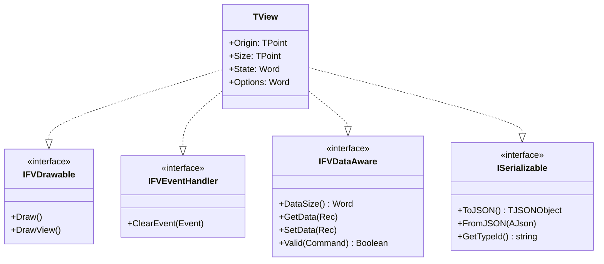
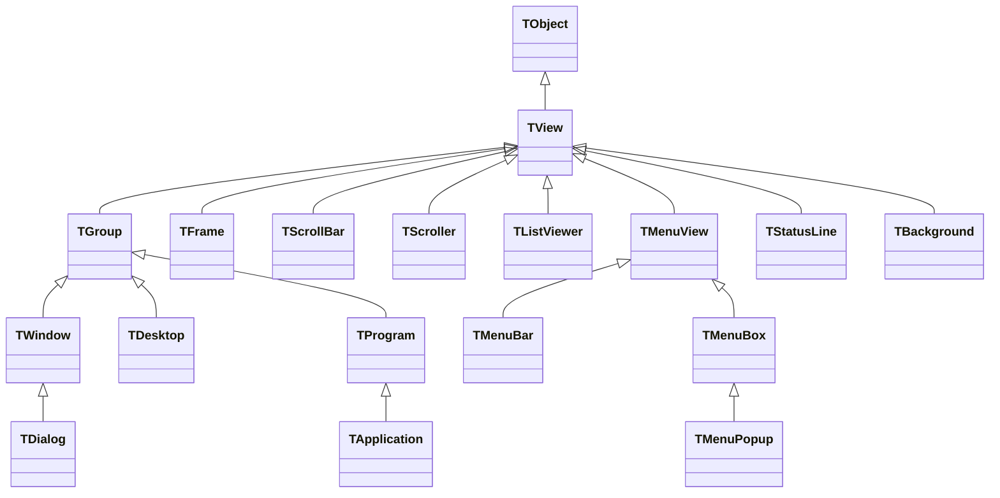
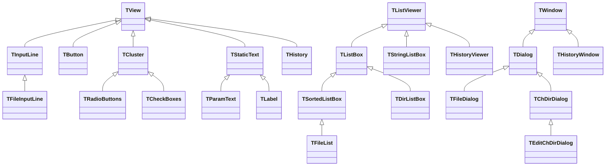
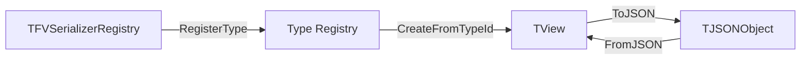

# Free Vision Modern - Architecture

This document describes the architecture of the modernized Free Vision framework for Delphi 12+.

## Overview

Free Vision Modern is a text-mode UI framework that provides a complete widget toolkit for console applications. It follows a classic Model-View-Controller-inspired design with a hierarchical view system.

```
+------------------------------------------------------------------+
|                         TApplication                              |
|  +------------------------------------------------------------+  |
|  |  TMenuBar                                                   |  |
|  +------------------------------------------------------------+  |
|  |                        TDesktop                             |  |
|  |  +------------------+  +------------------+                 |  |
|  |  |    TWindow       |  |    TDialog       |                 |  |
|  |  |  +-----------+   |  |  +-----------+   |                 |  |
|  |  |  | TScroller |   |  |  | TButton   |   |                 |  |
|  |  |  +-----------+   |  |  +-----------+   |                 |  |
|  |  +------------------+  +------------------+                 |  |
|  +------------------------------------------------------------+  |
|  |  TStatusLine                                                |  |
|  +------------------------------------------------------------+  |
+------------------------------------------------------------------+
```

## Layer Architecture

```
+------------------------------------------------------------------+
|                    Application Layer                              |
|         App.pas: TApplication, TProgram, TDesktop                |
+------------------------------------------------------------------+
|                     Widget Layer                                  |
|    Dialogs.pas: TDialog, TButton, TInputLine, TListBox, etc.     |
|    Menus.pas: TMenuBar, TMenuBox, TStatusLine                    |
|    Editors.pas, ColorSel.pas, Outline.pas, Tabs.pas, etc.        |
+------------------------------------------------------------------+
|                      View Layer                                   |
|         Views.pas: TView, TGroup, TWindow, TFrame                |
+------------------------------------------------------------------+
|                    Driver Layer                                   |
|         Drivers.pas: Event queue, keyboard, mouse                |
|         Video.pas: Console output (Windows Console API)          |
+------------------------------------------------------------------+
|                   Foundation Layer                                |
|         Objects.pas: TFVStream, string helpers                   |
|         FVCommon.pas: Platform types                             |
|         FVInterfaces.pas: Interface definitions                  |
+------------------------------------------------------------------+
```

## Interface Hierarchy

All view classes implement these interfaces for consistent behavior:



### Interface Details

| Interface | Purpose | Key Methods |
|-----------|---------|-------------|
| `IFVDrawable` | Rendering capability | `Draw`, `DrawView` |
| `IFVEventHandler` | Event handling | `ClearEvent` |
| `IFVDataAware` | Data binding for dialogs | `GetData`, `SetData`, `Valid` |
| `ISerializable` | JSON persistence | `ToJSON`, `FromJSON`, `GetTypeId` |

**Note**: Reference counting is disabled (`_AddRef`/`_Release` return -1) so views are managed manually, not by interface references.

## Class Hierarchy

### Core View Hierarchy



### ASCII Diagram: Core Views

```
TObject
    |
    +-- TView (implements IFVDrawable, IFVEventHandler, IFVDataAware, ISerializable)
          |
          +-- TGroup (container for child views)
          |     |
          |     +-- TWindow (framed, moveable window)
          |     |     |
          |     |     +-- TDialog (modal dialog)
          |     |
          |     +-- TDesktop (main application area)
          |     |
          |     +-- TProgram (application base)
          |           |
          |           +-- TApplication (full application with video init)
          |
          +-- TFrame (window frame decoration)
          |
          +-- TScrollBar (horizontal/vertical scrollbar)
          |
          +-- TScroller (scrollable content area)
          |
          +-- TListViewer (abstract list display)
          |
          +-- TMenuView (menu base)
          |     |
          |     +-- TMenuBar (horizontal menu bar)
          |     +-- TMenuBox (dropdown menu)
          |           |
          |           +-- TMenuPopup (context menu)
          |
          +-- TStatusLine (bottom status bar)
          |
          +-- TBackground (desktop background)
```

### Dialog Controls Hierarchy



### ASCII Diagram: Dialog Controls

```
TView
    |
    +-- TInputLine (text input field)
    |     |
    |     +-- TFileInputLine (file path input)
    |
    +-- TButton (clickable button)
    |
    +-- TCluster (group of options)
    |     |
    |     +-- TRadioButtons (single selection)
    |     +-- TCheckBoxes (multiple selection)
    |
    +-- TStaticText (label/text display)
    |     |
    |     +-- TParamText (parameterized text)
    |     +-- TLabel (linked label)
    |
    +-- THistory (input history dropdown)

TListViewer
    |
    +-- TListBox (generic object list display)
    |     |
    |     +-- TSortedListBox (searchable list)
    |     |     |
    |     |     +-- TFileList (file listing)
    |     |
    |     +-- TDirListBox (directory tree)
    |
    +-- TStringListBox (string list display - uses TStringList)
    |
    +-- THistoryViewer (history popup list)

TDialog
    |
    +-- TFileDialog (file open/save)
    +-- TChDirDialog (change directory)
          |
          +-- TEditChDirDialog (editable directory)
```

### Stream Hierarchy

```
TObject
    |
    +-- TFVStream (abstract stream base)
          |
          +-- TDosStream (file stream)
          |     |
          |     +-- TBufStream (buffered file stream)
          |
          +-- TMemoryStream (memory-based stream)
```

### Validator Hierarchy

```
TObject
    |
    +-- TValidator (abstract input validator)
          |
          +-- TPXPictureValidator (picture mask validation)
          |
          +-- TFilterValidator (character filter)
          |     |
          |     +-- TRangeValidator (numeric range)
          |
          +-- TLookupValidator (lookup-based validation)
                |
                +-- TStringLookupValidator (string list lookup)
```

### Collection Types

The framework uses modern Delphi generics:

| Type | Usage | Notes |
|------|-------|-------|
| `TStringList` | String content in `TStringListBox` | Standard RTL class |
| `TObjectList<TObject>` | Generic objects in `TListBox`, file/dir entries | RTL generic, manual memory management |
| `TFileCollection` | File search results | Extends `TObjectList<TObject>`, stores `PSearchRec` |
| `TDirCollection` | Directory entries | Extends `TObjectList<TObject>`, stores `PDirEntry` |

## Event Flow

```
+-------------+     +---------+     +----------+     +--------+
| Keyboard/   | --> | Drivers | --> | TProgram | --> | TView  |
| Mouse Input |     | GetEvent|     | HandleEvent    | HandleEvent
+-------------+     +---------+     +----------+     +--------+
                                          |
                                          v
                                    +----------+
                                    | TGroup   |
                                    | (routes to|
                                    | children) |
                                    +----------+
```

Events flow from hardware through `Drivers.GetEvent`, are dispatched by `TProgram.HandleEvent`, and propagate down through the view hierarchy. Views call `ClearEvent` to indicate an event was handled.

## View Ownership

```
TApplication (owns)
    |
    +-- MenuBar (TMenuBar)
    +-- Desktop (TDesktop) (owns)
    |     |
    |     +-- Window1 (TWindow) (owns)
    |     |     +-- Frame, ScrollBars, Content...
    |     +-- Window2 (TDialog) (owns)
    |           +-- Buttons, InputLines, ListBoxes...
    +-- StatusLine (TStatusLine)
```

**Key Ownership Rules:**
- `TGroup.Insert(View)` transfers ownership to the group
- When a `TGroup` is destroyed, all owned views are automatically freed
- Use `TGroup.Delete(View)` to remove without freeing
- Use `TGroup.Dispose(View)` to remove and free

## Color Palette System

Views use a palette-based color system for consistent theming:

```
TApplication.GetPalette (96+ colors)
    |
    +-- TWindow.GetPalette (8 colors, mapped from app palette)
          |
          +-- TButton.GetPalette (8 colors, mapped from window)
```

Each view's `GetColor(Index)` resolves through the palette chain to the application's master palette.

## Serialization Architecture



JSON serialization is implemented via `ISerializable`:

```pascal
function TView.ToJSON: TJSONObject;
begin
  Result := TJSONObject.Create;
  Result.AddPair('_type', GetTypeId);
  Result.AddPair('origin', PointToJSON(Origin));
  Result.AddPair('size', PointToJSON(Size));
  // ... additional properties
end;
```

## File Organization

```
src/
  FVCommon.pas        Platform types (Sw_Word, PString, etc.)
  FVInterfaces.pas    Interface definitions (IFVDrawable, ISerializable, etc.)
  FVSerialization.pas JSON serialization helpers and registry
  Objects.pas         Stream classes, string utilities
  Video.pas           Console output (Windows Console API)
  Drivers.pas         Input handling, event queue
  Views.pas           Core view classes (TView, TGroup, TWindow)
  Menus.pas           Menu system (TMenuBar, TMenuBox, TStatusLine)
  App.pas             Application framework (TApplication)
  Dialogs.pas         Dialog controls (TDialog, TButton, TInputLine, etc.)
  Validate.pas        Input validators
  MsgBox.pas          Message box helpers
  StdDlg.pas          File dialogs (TFileDialog, TChDirDialog)
  Editors.pas         Text editor component
  ColorSel.pas        Color selection dialog
  Outline.pas         Tree/outline view
  Tabs.pas            Tab control
  Statuses.pas        Progress indicators
  Gadgets.pas         Clock, heap views
  HistList.pas        Input history management
  fvconsts.pas        String constants
  platform.inc        Compiler/platform detection
```

## Memory Management

| Pattern | Usage |
|---------|-------|
| `TClass.Create(...)` | Object creation |
| `Object.Free` or `FreeAndNil(Object)` | Object destruction |
| `TGroup` ownership | Views freed when parent group destroyed |
| `NewStr(S)` / `DisposeStr(P)` | Legacy `PString` (ShortString pointer) |
| `TObjectList<T>` with `OwnsObjects=False` | Collections of record pointers |

## Platform Abstraction

`platform.inc` defines:

| Define | Meaning |
|--------|---------|
| `PPC_DELPHI` | Compiling with Delphi |
| `PPC_FPC` | Compiling with Free Pascal |
| `BIT_32` / `BIT_64` | CPU architecture |
| `OS_WINDOWS` | Windows target |

## Build Configuration

- **Platform**: Win32 (32-bit Windows)
- **Configuration**: Debug for development
- **Range checking**: OFF (`{$R-}`) in units with pointer arithmetic
- **Test application**: `FVTest.exe`
